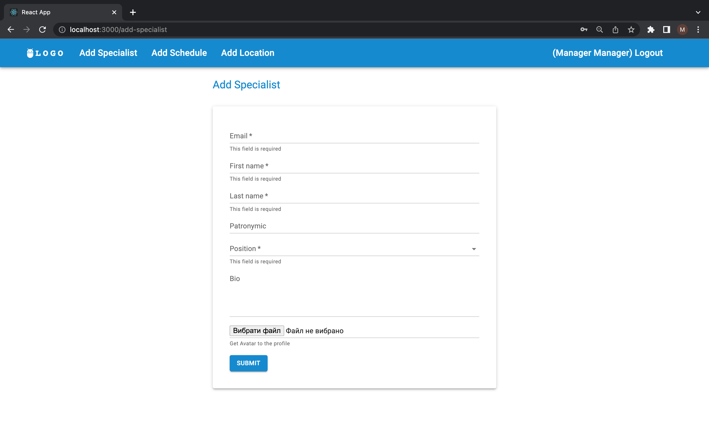
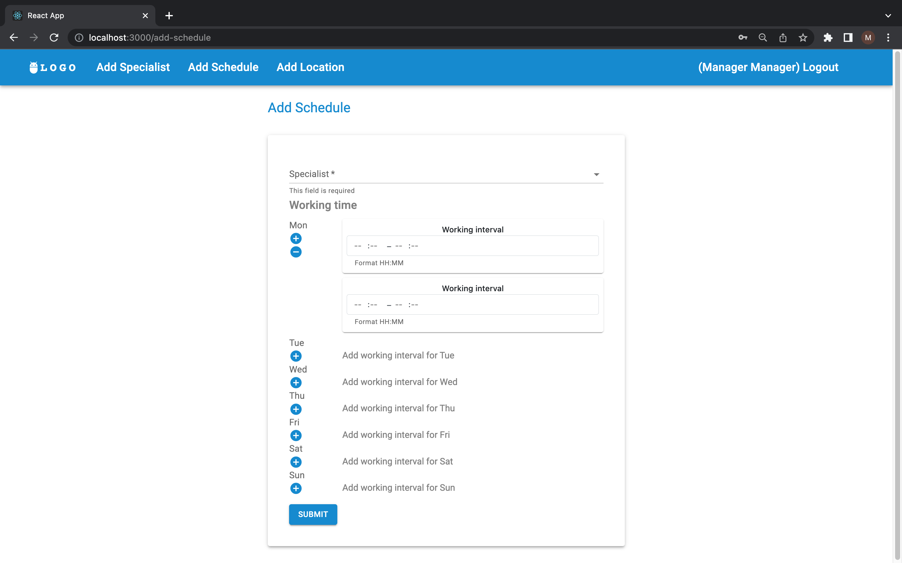

# BusinessManageProject


Project was created in order to bring customers closer to the service providers of the some business industry.    
I am trying to improve the interaction of the main participants in these processes. 
The client is provided with tools for convenient searching the specialists of a business,
filtering them according position and checking their schedules for concrete date. 
In project is present three main role: an owner, an admin and a manger.
Admin can make an appointments for clients to the specific specialist at the concrete his free working time. 
Manger creates profile for the specialists, adds working locations and schedule for specialists.


---
Content
- [Installation](#Installation)
  - [Clone](#Clone-or-Download)
  - [Required to install](#Required-to-install)
  - [Environment](#Environment)
  - [How to run local](#How-to-run-local)
  - [How to run Docker](#How-to-run-Docker)
  - [Setup using the terminal](#Setup-using-the-terminal)
  - [Setup using docker](#Setup-using-the-docker)
- [Tests](#Tests)
- [Usage](#Usage)
- [Teams](#Teams)

----

## Installation

### Clone or Download

-  Clone this repo to your local machine using   
```
git clone https://github.com/Misha86/BusinessManageProject.git
```
  or download the project archive: https://github.com/Misha86/BusinessManageProject/archive/refs/heads/main.zip    

<a name="footnote">*</a> - to run the project you need an `.env` file in root folder

### Required to install

- [](https://www.python.org/downloads/release/python-3912/) 3.9.12
- Project reqirements:
```
pip install -r requirements.txt
```

### Environment

- Add the environment variables file (.env) to the project folder.
It must contain the following settings:
```
SECRET_KEY = '😊YOUR_SECRET_KEY😊'
DEBUG = False
ALLOWED_HOSTS = *
POSTGRES_DB = '😊YOUR_DB_NAME😊'
POSTGRES_USER = '😊YOUR_DB_USER😊'
POSTGRES_PASSWORD = '😊YOUR_DB_PASS😊'
POSTGRES_HOST = '😊YOUR_DB_HOST😊'
POSTGRES_PORT = '😊YOUR_DB_PORT😊'
```

### How to run local

- Start the terminal.
- Go to the directory "your way to the project" BusinessManageProject / business_manage
- Run the following commands
```
python manage.py makemigrations
python manage.py migrate
python manage.py runserver
```

### How to run Docker

- Go to the main directory - BusinessManageProject
- Run our project using Docker
```
docker-compose up --build
```


### Setup using the terminal

- Create a superuser:    
```
python manage.py createsuperuser
```
- Create a admin:    
```
python manage.py createadmin
```
- Create a manager:    
```
python manage.py createmanager
```

### Setup using the docker

- Create a superuser:    
```
docker-compose run app python business_manage/manage.py createsuperuser
```
- Create a admin:    
```
docker-compose run app python business_manage/manage.py createadmin
```
- Create a manager:    
```
docker-compose run app python business_manage/manage.py createmanager
```

----

## Tests
The project will use FakeFactory for tests in future

- Run project tests:
```
python manage.py test
```

## Using flake8

- Install flake8 according to python version:

```
python3.9 -m pip install flake8
```

- Install flake8 extensions:

```
pip instll -r requirements-flake8.txt
```

- Install pre-commit:

``` 
pip install pre-commit
```

- Make sure there are files `.flake8` & `.pre-commit-config.yaml` in the project 
directory

- Create hook:

```
pre-commit install
```

- Settings are ready to use. Before committing, the hook will run 
a flake8 check. If the check does not pass the commit will not take place.

---

## Using coverage

- Install coverage according to python version:

```
pip install coverage
```

- Run tests coverage from main directory:

```
coverage run business_manage/manage.py test api
```

- Check coverage report:

``` 
 coverage report
```

- Create html coverage report:

``` 
 coverage html
```

- Open html report file in the browser:

``` 
 ./htmlcov/index.html
```

----

## Usage

Endpoints from the project you can use in the frontend part, 
Postman or Swagger. We use standard DRF API in this example.

- Run server 
```
python manage.py runserver
```
or 
```
docker-compose up
```
- Open in the browser URL http://0.0.0.0:8000

[](http://0.0.0.0:8000)

### Manager role
Managers can add new specialists to the business, 
create schedules, and add new working locations for the business.

- Login as manager

#### Create a new specialist

- Use URL http://0.0.0.0:8000/api/specialists



- Fill form and sent request


#### Create a schedule for specialist

- Use URL http://0.0.0.0:8000/api/schedules



- Fill form and sent request


#### Create a new location

- Use URL http://0.0.0.0:8000/api/locations


- Fill form and sent request

### Admin role
Admin adds an appointment for clients and specialists.

- Login as admin

#### Create a new appointment

- Use URL http://0.0.0.0:8000/api/appointments


- Fill form and sent request

### Customer role
Customers can review a list of specialists, filter them by position,
get the schedule for specific specialists and a concrete date.

#### Get all specialists

- Use URL http://0.0.0.0:8000/api/specialists


#### Filter specialists by position

- Use URL http://0.0.0.0:8000/api/specialists/?position=<<PositionTitle>>


#### Get schedule for concrete date

- Use URL http://0.0.0.0:8000/api/specialists/<<SpecialistId>>/schedule/<<Date>>


----

## Teams

### Development team 
[](https://github.com/Misha86)

---
