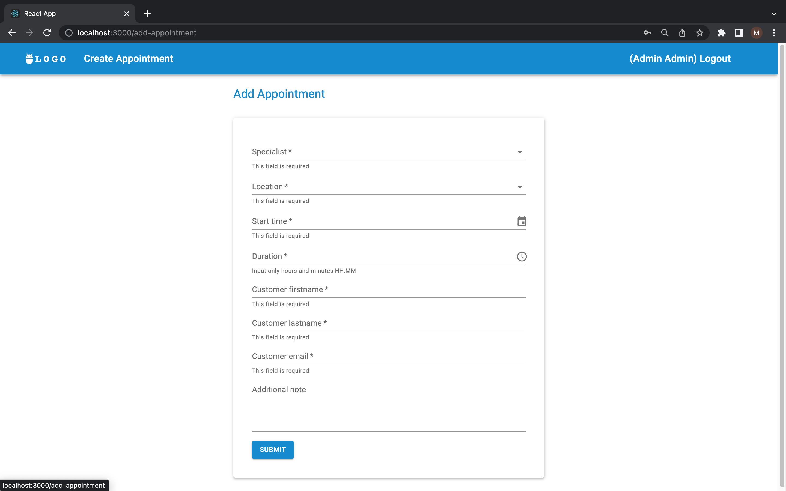

# BusinessManageProject

The project was created in order to bring customers closer to the service providers of some business industries.
I am trying to improve the interaction of the main participants in these processes.
The client is provided with tools for convenient searching for the specialists of a business,
filtering them according to position and checking their schedules for a concrete date.
Four main roles are present in the project:
- Owners are superusers who have all permissions.
- Admins can make appointments for clients with the specific specialist at the concrete his free working time.
- Managers create profiles for the specialists, add working locations and schedule for specialists.
- Specialists - company employees.

---
Content
- [Installation](#Installation)
  - [Clone](#Clone-or-Download)
  - [Required to install](#Required-to-install)
  - [Environment](#Environment)
  - [How to run local](#How-to-run-local)
  - [How to run Docker](#How-to-run-Docker)
  - [Setup using the terminal](#Setup-using-the-terminal)
  - [Setup using docker](#Setup-using-the-docker)
- [Tests](#Tests)
- [Usage](#Usage)
- [Teams](#Teams)

----

## Installation

### Clone or Download

-  Clone this repo to your local machine using   
```
git clone https://github.com/Misha86/BusinessManageProject.git
```
  or download the project archive: https://github.com/Misha86/BusinessManageProject/archive/refs/heads/main.zip    

<a name="footnote">*</a> - to run the project you need an `.env` file in root folder

### Required to install for the backend part

- [](https://www.python.org/downloads/release/python-3109/) 3.10
- Project reqirements:
```
pip install -r requirements.txt
```

### Environment

- Add the environment variables file (.env) to the project folder.
It must contain the following settings:
```
SECRET_KEY = '😊YOUR_SECRET_KEY😊'
DEBUG = False
ALLOWED_HOSTS = *
POSTGRES_DB = '😊YOUR_DB_NAME😊'
POSTGRES_USER = '😊YOUR_DB_USER😊'
POSTGRES_PASSWORD = '😊YOUR_DB_PASS😊'
POSTGRES_HOST = '😊YOUR_DB_HOST😊'
POSTGRES_PORT = '😊YOUR_DB_PORT😊'
CORS_ALLOWED_ORIGINS='😊YOUR_FRONTEND_HOST😊'
PYTHONPATH='😊YOUR_PATH_TO_ROOT_DACKEND_FOLDER😊'
DJANGO_SETTINGS_MODULE='😊YOUR_BACKEND_SETTINGS_FILE😊'
```

### How to run the backend locally

- Start the terminal.
- Go to the directory "your way to the project" BusinessManageProject / business_manage
- Run the following commands

```
python manage.py makemigrations
python manage.py migrate
python manage.py runserver
```

### Required to install for the frontend part

- [](https://nodejs.org/uk/blog/release/v18.12.1/) v18.12.1

### How to run the frontend locally

- Start the terminal.
- Go to the directory "your way to the project" BusinessManageProject / frontend
- Run the following commands
```
npm install
npm run start
```
### How to run Docker

- Go to the main directory - BusinessManageProject
- Run our project using Docker
```
docker-compose up --build
```

<br/>

### Setup using the terminal

##### Go to the business_manage directory

- Create a superuser:    
```
python manage.py createsuperuser
```
- Create a admin:    
```
python manage.py createadmin
```
- Create a manager:    
```
python manage.py createmanager
```
- Create fake specialists for tests:    
```
python manage.py specialists --create --count 10 --add_schedule
```
`--create` - for creating specialists \
`--count` - number of specialists \
`--add_schedule` - add schedules for all specialists 
- Delete all specialists:    
```
python manage.py specialists --delete_all
```
<br/>

### Setup using the docker

- Create a superuser:    
```
docker-compose run app python business_manage/manage.py createsuperuser
```
- Create a admin:    
```
docker-compose run app python business_manage/manage.py createadmin
```
- Create a manager:    
```
docker-compose run app python business_manage/manage.py createmanager
```
- Create fake specialists for tests:    
```
docker-compose run app python business_manage/manage.py specialists --create --count 10 --add_schedule
```
- Delete all specialists:    
```
docker-compose run app python business_manage/manage.py specialists --delete_all
```

----

## Tests
The project uses Factory Boy for tests

- Run project tests:
```
python manage.py test
```

## Using flake8

- Install flake8 according to python version:

```
pip install flake8
```

- Install flake8 extensions:

```
pip instll -r requirements-flake8.txt
```

- Install pre-commit:

``` 
pip install pre-commit
```

- Make sure there are files `.flake8` & `.pre-commit-config.yaml` in the project 
directory

- Create hook:

```
pre-commit install
```

- Settings are ready to use. Before committing, the hook will run 
a flake8 check. If the check does not pass the commit will not take place.

---

## Using coverage

- Install coverage according to python version:

```
pip install coverage
```

- Run tests coverage from main directory:

```
coverage run business_manage/manage.py test api
```

- Check coverage report:

``` 
 coverage report
```

- Create html coverage report:

``` 
 coverage html
```

- Open html report file in the browser:

``` 
 ./htmlcov/index.html
```

----

## Usage

Endpoints in the project you can use in the frontend part, Postman or Swagger. I used the frontend part which consists of React JS, its dependencies and Material UI for designing the site.
- Run server for the backend
```
python manage.py business_manage/manage.py
```
- Run server for the frontend
```
cd frontend && npm start
```
or 
```
docker-compose up --build
```
- Open in the browser URL http://localhost:8000 (list of specialists)

[](http://localhost:3000)

### Manager role
Managers can add new specialists to the business, create schedules, and add new working locations for the business.

- Login as manager
- Use URL <http://localhost:3000/login>


#### Create a new specialist

- Use URL <http://localhost:3000/add-specialist>


- Fill form and sent request

#### Create a schedule for specialist

- Use URL <http://localhost:3000/add-schedule>


- Fill form and sent request


#### Create a new location

- Use URL <http://localhost:3000/add-location>


- Fill form and sent request

### Admin role
Admin adds an appointment for clients and specialists.

- Login as admin

#### Create a new appointment

- Use URL <http://localhost:3000/add-appointment>



- Fill form and sent request

### Customer role
Customers can review a list of specialists, filter them by position and working date, get the schedule for specific specialists and a concrete date, view specialist page.

#### Get specialist page

- Use URL <http://localhost:3000/specialists/(specialist_id)>


----

## Teams

### Development team 
[](https://github.com/Misha86)

---
